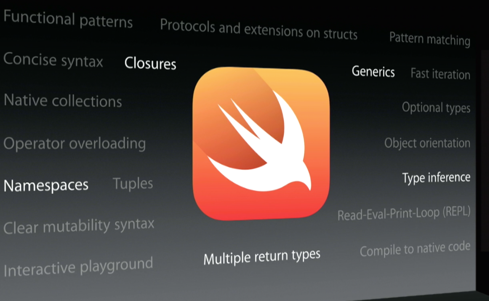

## Don't be "an Objective-C" **or** "a Swift developer"
### *Bryan Irace*
#### *August 29, 2014*


^ Today, I'm going to spend my 20 minutes up here suggesting that you *don't* become an Objective-C developer, or a Swift developer.

---

## Be a software developer

^ Instead, I'm going to suggest you become a software developer, who happens to use Swift or Objective-C to build apps.

^ It may sound like a subtle distinction, but I think it's a particularly important one.

---

## Being a great developer means being a great problem solver

^ In my opinion, your biggest asset as a developer is not your grasp on language concepts…

---

## Being a great problem solver means drawing from varied experience

^ …but how many different types of problems, of all shapes and sizes, that you’ve encountered throughout your career. You’ll be a better developer if you’ve fought animation bugs, database bugs, and everything in between. This is more important than syntax.

---

> "We need to reach that happy stage of our development when differences and diversity are not seen as sources of division and distrust, but of strength and inspiration."

- Josefa Iloilo

^ One most important factors when building development/any team, is diversity. Applies to far more important social issues than programming but applicable to what we do as well. Need developers from different backgrounds to approach problems from perspectives. Lets stop being theoretical and look at code.

---

```javascript
var stooges = [{ name: 'curly', age: 25 },
               { name: 'moe', age: 21 },
               { name: 'larry', age: 23 }];

var youngest = _.chain(stooges)
  .sortBy(function (stooge) {
    return stooge.age; 
  })
  .map(function (stooge) {
    return stooge.name + ' is ' + stooge.age; 
  })
  .first()
  .value();
```

^ So, this is something we'd just about *never* see in Objective-C – method chaining. Can anyone tell me what's good about this? Doesn't clutter local scope with variables, doesn't allow you to accidentally pass the wrong intermediate value into the next part of the chain.

---

```objc
[[[stooges sortedArrayUsingDescriptors:
   @[[NSSortDescriptor sortDescriptorWithKey:@"age"
                                   ascending:YES]]]
  transformedArrayUsingBlock:^NSString *(NSDictionary *stooge) {
      return [NSString stringWithFormat:@"%@ is %@",
              stooge[@"name"], stooge[@"age"]];
  }] firstObject];
```

^ What comes to mind when you look at this code?

---

## Yes, it's ugly

### *But the benefits are all still there*

^ It's fine to think that you shouldn't code a certain way if it's ugly. Meant to be legible/read by others/can make an argument that that's reason enough for coding a certain way. Important to be of the mindset: "I won't use method chaining *here, because*”…, not: "method chaining is bad".

---

> "Header files are the only good way to manage code visibility"

^ It's really easy to become dogmatic about a programming language when you spend all day working in it.

---

> "Of course you should always use methods instead of functions"

---

> "Generics? Don't need 'em"

^ If you’ve been following the Objective-C community for long enough, you may have heard people say things along these lines

---

## Your favorite programming language is an implementation detail

^ Please don't take this the wrong way. Programming languages are awesome. I personally get a ton of enjoyment out of learning them. But I don't think you're here today because you're a language lover. Choosing iOS platform = you want to build great apps. That's the lens to view languages through.

---



^ So now we have Swift. If built software in JavaScript/Java, you may have an easier time coming around to the changes. Works the other way too though; Obj-C folks will find some parts easier to digest than others. A new language forces you to re-evaluate what you like/dislike.

---

## What I'm *not* saying:
### You're screwed if you only know Objective-C

^ So this conference was billed as being about "the ups and downs of learning iOS", which means it's reasonable for me to assume that not *all* of you are language polyglots, with years of experience in many languages. And that's totally fine!

---

## Strong opinions
## Weakly held

^ When you've got a chance, step outside your comfort zone. It doesn't need to be new language; framework, *type* of app even. Broader your experiences are, the better a programmer you're going to be. Swift is a great chance to step outside. Not even a chance = mandate.

---

> "What would you change about Objective-C?"

^ Many don't have an answer. Understand not everyone has years of experiences with other languages, but if want to become *really good* at your craft, doing yourself disservice by not learning what else is there/understanding how you'd like platform to evolve.

---

> "One of the biggest constants in software development: the unerring sense among developers that the level of abstraction they're currently working at is exactly the right one for the task at hand."

- John Siracusa, [Copland 2010 revisited](http://arstechnica.com/apple/2010/06/copland-2010-revisited/2/)

^ John wrote for years about a new lang. He knew it wasn’t dire, we didn’t need it today, but that we’d need it eventually. Lots of folks who loved Obj-C disagreed with him. But he’s right.

---


^ Because you never know when you're suddenly going to have the opportunity to actually impact it. If told you that Apple would be coming out with a brand new lang., wouldn't believe. But if told you *discussing its development candidly, in the open, on the developer forums/blog*…

---

> "If I start using it now, I can provide feedback, and that feedback will help shape the programming language that I’m likely to use for the rest of my career. 

- Brent Simmons

^ Tends to think out loud in the form of blog posts, talking about adopting Swift. Could cling stubbornly but knows profession is about software, not languages. Played with enough languages to know what he'd like to see out of the one that he's going to spend his days writing.

---
 
> "Maybe I’ll have a ton of feedback, and maybe I’ll have none — but I’d sure hate to have missed my chance to help."

^ And herein lies the reason why it’s important to understand concepts and not just language syntax. When Apple comes asking what you’d like to see…

---

## You can't ask for what you don't know that you're missing

---

## Thank you
###  @irace