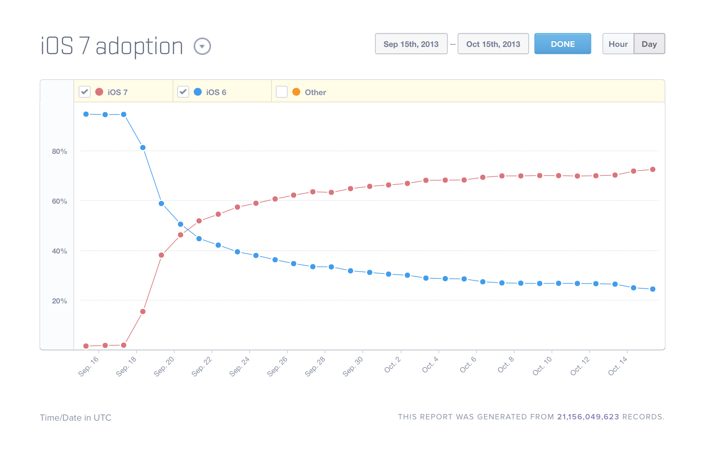
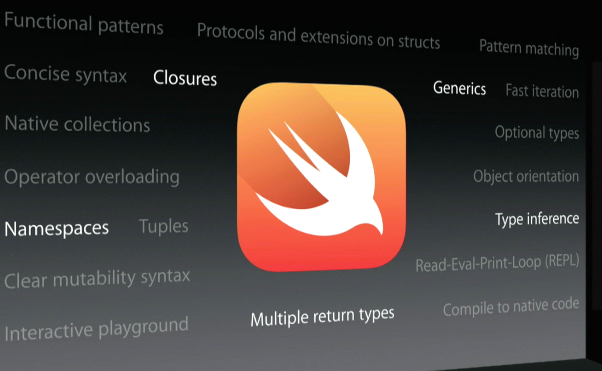
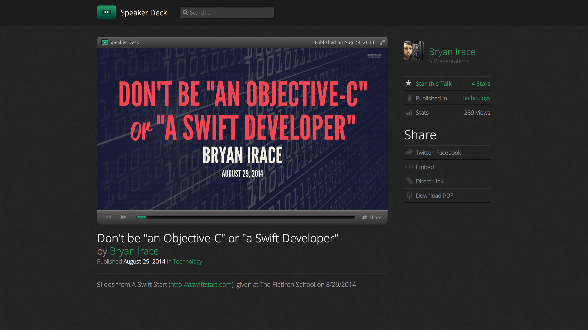

# When the iOS SDK says “Jump,” ask “How high?”
## Bryan Irace
### September 25, 2014

^ So when Shelby first reached out and asked if I was interested in speaking this evening, particularly to discuss Swift, I was a little hesitant. I told her that I haven't really written any Swift, that I'd been focused on other parts of iOS 8 such as extensions and adaptive layout. She reassured me that this was fine, and that it'd still be interesting to hear my thoughts on adopting Swift. When is the right time? What should an iOS developer's mindset be? I found this to be a pretty fascinating question and this short talk came to me pretty quickly as a result. So let's talk about it.

---

^ For those of you don't know me, my name is Bryan, I work on the iOS team at Tumblr. You can't really see it in this photo but this is a banner from WWDC where Apple included the Tumblr icon in their list of share extensions. So we kind of didn't really have a choice when it came to making sure we had one ready for the iOS 8 launch. I guess you'd refer to this as banner-driven development?

---

# “Hardest problems in software development”

* ~~Naming things~~
* ~~Cache invalidation~~
* ~~Off-by-one errors~~
* Deciding when to adopt new technologies

^ So I'm sure you're familiar with this joke about what the hardest problems in software development are. Well, I think one of the *actual* hardest problems is deciding when it's the right time to adopt a new technology. And this doesn't just apply to iOS development, but to other mobile platforms, web development, server-side stuff, etc. It's really hard!

---

# Adopting new technologies: pros

* New capabilities
* Cleaner code
* Indeterminate potential future benefits

^ Of course, one of the big selling points is that there's usually something *new* that you can do, that you couldn't do before. There's a new feature that you can only do if you update to the new framework.

^ Sometimes it's a matter of replacing brittle code that you hate maintaining with something cleaner and less error prone.

^ And then of course there are the unknown benefits that may or may not actually happen one day? Managers *love* this, they love commiting a bunch of developer resources towards something without knowying if they're actually going to get anything positive out of it or not.

---

# Adopting new technologies: cons

* Maintain backwards compatability
* Learning curve
* Premature
* Spending time replacing working code instead of building something new

^ Maybe the only way you can adopt a new technology is to break backwards compatability.
^ Obviously there's going to be a learning curve. You're not going to be as productive with something you're still learning than you are with somethging you're already familiar with, so there's an upfront cost while you ramp up and learn by trial and error.
^ New APIs might not be bug free. We see this quite a lot, as great as it is to run out and try to use the new hotness, it's sometimes ideal to wait and let someone else find all of the problems and workarounds for you. If you happened to read my blog post from a week or so ago about extensions, you're laughing at me right now because *I'm the guy* who had to find all the problems, but you can't win them all.
^ Lastly, there's opportunity cost here. If you're replacing code that works with something new, you're *not* building something new for your users. It's all the same to them. And you might even take something that was working and make it worse. That's never good.

---

# iOS apps warrant faster adoption than other platforms

^ Those are the platform-independent pros and cons, but I'm going to argue that iOS is special in that makes sense to adopt new technologies *earlier* on iOS than it does on other platforms. Let's pick apart why. 

---

^ Nothing standing between Apple and consumers. Granted, iOS 8 adoption hasn't been this fast. But this is still crazy compared to either Android or the web. Auto-updating browsers like Chrome help, but there are still too many browsers.

---

^ The update velocity is just *astounding*. Once a year, we get a *ton* of new APIs. Now iOS 8 is out and I don't know about you, but there are still technologies from iOS 7 and even 6 that I haven't fully adopted yet. If you're going to put off learning something for a year, keep in mind that there's a good chance you're going to have way more stuff that you need to learn a year from now. It can be overwhelming if you don't pace yourself.

^ Compare this to the web, where first-party technologies like CSS, HTML, and JavaScript require committees and evolve very slowly.

---

# Assume  has big plans for the technologies they push

## Adopt accordingly

^ Here's the third reason why iOS is different when it comes to adoption. You can make a pretty safe assumption that when Apple debuts a new technology and pushes it even somewhat heavily to developers, that it's going to end up being a bigger deal than it seems at the moment. Let's go through a bunch of examples of this.

---

# UICollectionView

## Added in iOS 6

^ If you're still supporting iOS 5, you're not going to replace your UITableView with a collection view. But maybe you should.

---

# UICollectionView

## iOS 7: UICollectionViewTransitionLayout

---

# NSURLSession

## Added in iOS 7

^ I know, it's hard because you already have plenty of NSURLConnection code that *works*, so why mess with it?

---

# NSURLSession

## iOS 8: Extensions

---

# Asset catalogs

## Added in iOS 7

---

# Asset catalogs

## iOS 8: Vector assets

^ Now the iPhone 6 and 6 Plus are only a couple of weeks away from launching, and you're scrambling not only to convert all of your assets, but to migrate to asset catalogs as well. If you had done this months earlier, closer to when Apple release it and started pushing it as the way forward, you would've been in much better shape.

---

# Storyboards

## Added in iOS 5

---

# Storyboards

## iOS 8: Universal storyboards

---

# Auto Layout

## Added in iOS 6

---

# Auto Layout

## iOS 8: Universal storyboards, self-sizing table view cells

---

# Size classes

## Added in iOS 8 (June)

^ This one is a little different since it was blatantly obvious *why* the new APIs were added, but the point remains

---

---

# Swift

## Added in iOS 8

^ So now Swift, what this talk is in theory supposed to be about at a high level. Swift is no different from everything else that I've just listed. It's something that purports to have quite a few new benefits, but will require a learning period in which you won't be nearly as efficient as you are today with Objective-C, which will be hard to sell your manager on. 

^ And maybe you flat out don't *like* Swift, and you'd rather just keep using what you know.

---

# Swift

## WatchKit? Apple TV SDK?

^ But just like with Auto Layout, UICollectionView, and NSURLSession, there'll come a time when you *need* to use Swift in order to do something that you really want to be able to. And then you'll be rushing to learn Swift the same way you rushed to convert your Xcode project to use Asset Libraries.

---

^ I was actually invited to speak here based on another short talk I gave a few weeks back at the Swift Start conference, targeted mainly at beginners. The goal was to convey something that I wish I knew when I was first getting started, and I ended up talking about the importance of *not* getting too dogmatic about what programming language you use.

---

## “I prefer using a C-based language”
## “Generics are ugly”
## “I can't work without header files”

^ These are just a couple of things that someone who really likes Objective-C might say about Swift. And you could make similar statements to back up the decision to stick with any of the older technologies mentioned in this talk. Maybe you just really prefer manual framesetting code over Auto Layout. I think there are a lot of people who do, and that's a completely valid point of view.

---

# Use whichever tools will allow you to make the best apps both today *and* tomorrow

^ But what's important here is that we continue to evolve our skillsets in such a way that'll enable us to build the best apps for our customers. It's important to look past the short term in this industry and learn the tools necessary to make the highest quality software. Whether you like it or not, that's Swift

---

# Takeaways

* Only support the latest OS version (if possible)
* Adopt new frameworks early-ish
* Use these examples to justify the upfront cost

^ Don't build least common denominator apps. Apple supports devices for a long time, people in US are on two-year contracts, make your apps better by focusing. *And* this will help you ditch UITableView earlier.

^ You don't need to be the *first* one, but otherwise the number of things that you have to learn will pile up and overwhelm you. And your software quality will suffer as a result.

^ I hope that these examples help illustrate why it's a pretty safe bet when you're working on a platform run by a dictator – and I mean that in the best way possible – instead of a standards body.

---

# Start learning Swift

## (I need to take my own advice)

---

# Show your manager these slides if needed

---

# Thank you
##  @irace
