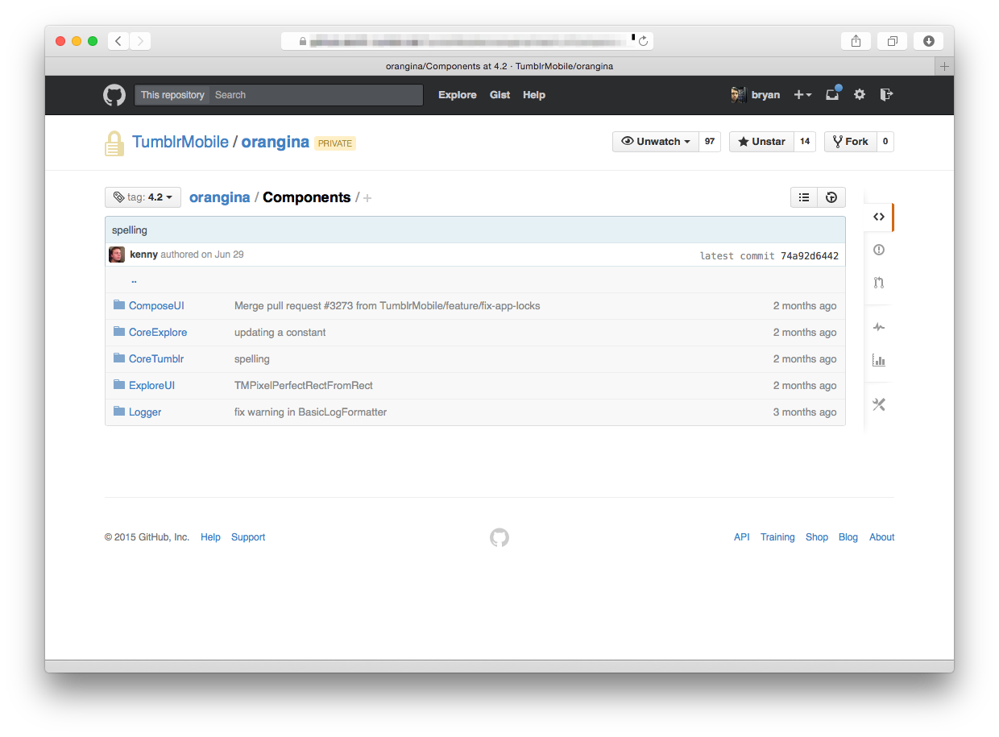
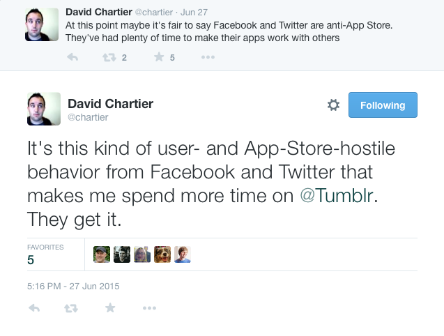

# iOS at Tumblr
### Bryan Irace, 8/20/2015

---

# The teams: 2012 - 2015

* One iOS team and one Android team
    - Up to ~8 developers each

---

# The teams: 2015 – ?

* iOS and Android “Core” teams
    - ~3-4 developers each
* iOS and Android engineers embedded on each product team
    - ~5 full time (per platform)
    - ~10 part-time/trainees (per platform)

---

# Internal training

---

# Horizontal camraderie

* Public Slack channels (`#ios`, `#ios_core`)
* Weekly variety hours (“Multipeer Connectivity”)
* Pair programming system
* In-person code reviews
* Speaker series
* Remote-friendly
* 🍔🍕

---

# Development

* [Git flow](http://nvie.com/posts/a-successful-git-branching-model/)
* Pods checked into source control

---

# Products

---

# Code organization

* Development pods in our primary repo
* Pods in separate internal (private) repos
* Open source pods
  - `TMTumblrSDK`

---

---

---

# Languages

* Lots of Objective-C
* Most new code in Swift

---

# Pull requests

* PRs need milestones to be reviewed
* Each release has a “driver”
    - Assigns PRs in a round-robin order (responsible for merging)
    - Responsible for sending out beta builds,

---

# [You are not your code](http://sstephenson.us/posts/you-are-not-your-code)

---

# Releases

* Submit to the App Store every two weeks
  - Development completion “lockdown” dates
* Feature flagging
    - Phased roll-outs
    - Flag off code that isn’t finished yet

---

---

# Automation

* Slack bot for distributing beta builds
* Nightly alpha builds
* Builds and runs tests for each PR
* Fastlane for App Store submissions
  - Ideally would happen automatically

---

---

# Core tenets

* Offline support
* Being good platform citizens

---

---

# Biggest challenges

* Heterogenous content
  - Media-heavy
      - Scroll performance
      - Memory footprint
* Rich text rendering

---

# Thanks! ❤️
